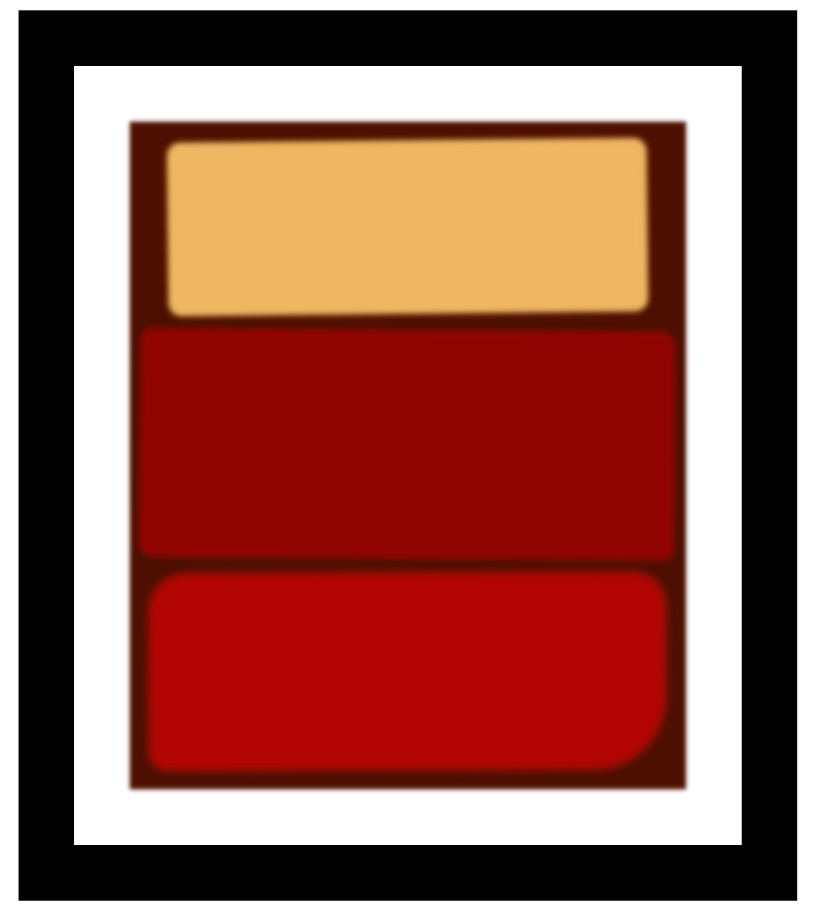

# Rothko Painting

A simple Rothko-style painting built with HTML and CSS.

## Features

- Uses CSS box model, borders, margin, padding  
- Applies blur and shadow effects  
- Inspired by Mark Rothko’s abstract style  
- Part of freeCodeCamp's Responsive Web Design course

## Preview

## How to Use

1. Open `index.html` in your browser  
2. View the painting design  
3. No interaction — it’s a static visual project

## Project Link

[Build a Rothko Painting - freeCodeCamp](https://www.freecodecamp.org/learn/2022/responsive-web-design/learn-the-css-box-model-by-building-a-rothko-painting/step-1)
